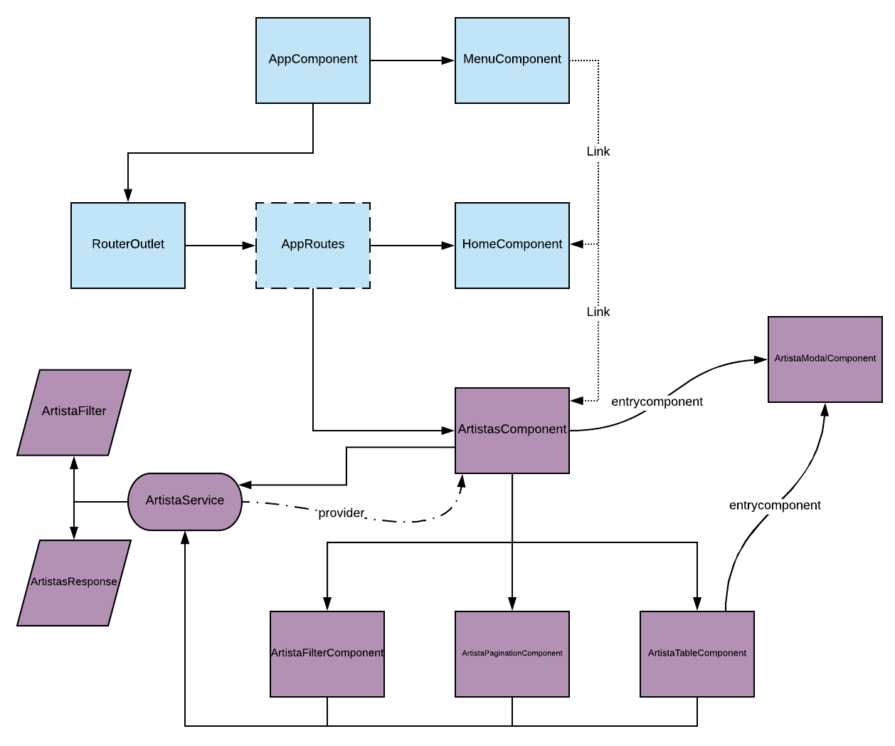

🌍 ∙ [English](angular.md) ∙ [Español](angular-es.md)

# Arquitectura del proyecto generado para Angular

## Esquema de arquitectura 

## Estructura base

Al ejecutar el comando `goten new-angular proyecto` se generará la estructura base del proyecto de Angular, el cuál contiene todo lo generado por `ng new proyecto`, e instala las dependecias de *Bootstrap 4* y *fontawesome*. Ademas se genera una estructura de carpetas y archivos base:  
- `proyecto/src/app/components/`: carpeta donde se agregarán los componentes que se autogeneren.  
- `proyecto/src/app/components/home.component/*`: componente **home**, pantalla inicial de la app.  
- `proyecto/src/app/components/menu.component/*`: componente **menu**, donde se registran los distintos tabs y a donde linkean los mismos. En ***menu.component.ts*** pueden observarse dos lineas de comentarios (*//\<tabs>* y *//\</tabs>*) las cuales son utilizadas por *goten* para agregar código dinámicamente, es por esto que estas líneas no deben ser modificadas por el usuario.  
- `proyecto/src/app/components/generics/*`: componentes base que utilizan los componentes que se autogeneren.  
- `proyecto/src/app/dtos/`: carpeta donde se agregarán los datos de las entidades que se consuman de la API.  
- `proyecto/src/app/dtos/filters/`: carpeta donde se agregarán los filtros que se utilizan en los forms. De estos se obtendra la *queryString* para consultar la API.  
- `proyecto/src/app/dtos/filters/generic.filter.ts`: filtro del que heredarán todos los filtros autogenerados. Permite obtener la *queryString* mediante el método *toQueryString*.  
- `proyecto/src/app/dtos/responses/generic.response.ts`: contiene algunos *responses* genéricos, de los cuales heredarán los autogenerados, o serán utilizados de forma directa por los servicios. ***GenericResponse*** recibe un tipo obligatorio, el cual será hidratado *body* de la response, el segundo es un tipo opcional para hidratar el error que pueda responder la *API*, se utiliza heredando de esta clase, especificando los tipos; su uso puede verse al solicitarle a la API una entidad especificando un *id*. ***GenericListResponse*** sigue el mismo principio que ***GenericResponse***, recibe un tipo obligatorio, se utiliza para realizar consultas que devuelven una lista con una determinada estructura, esta misma es especificada por el tipo especificado. ***IdResponse*** su uso esta pensado para realizar **DELETE** contra una *API*, la cual devuelve el *id* del objeto eliminado.  
- `proyecto/src/app/services/`: carpeta en la que se ubicarán los servicios autogenerados.  
- `proyecto/src/app/app.routes.ts`: en este archivo se registran las rutas y los componentes a los que cada una referencia, en este archivo tenemos cuatro lineas de comentarios (*//\<imports>*, *//\</imports>*, *//\<routes>* y *//\</routes>*) que sirven para registrar las nuevas rutas cada vez que *goten* genera un **ABM**, es por esto que las mismas no deben ser modificadas/eliminadas por el usuario.  

Los compoenentes esenciales, y como se relacionan estan representados en el [gráfico](#angular-architecture) en celeste.

## Estructura de abm

Al ejecutar el comando `goten abm-angular ejemplo` se generan los componentes, servicio, el filtro, responses, se registran las rutas en *app.routes.ts*, y se crea el tab en *menu.component.ts*. Los archivos generados son:  
- `proyecto/src/app/dtos/ejemplo.dto.ts`: en este archivo se creará la clase **EjemploDTO** con las properties especificadas por el usuario. Los tipos *Coustom* especificados también son creados en este archivo.  
- `proyecto/src/app/dtos/filters/ejemplo.filter.ts`: este archivo exporta la clase *EjemploFilter*, que tiene todas las properties de tipo nativo (excluyendo arrays). Esta clase es utilizada para indicar el criterio de búsqueda que se desea aplicar; como hereda de *GenericFilter* posee el método *toQueryString* que se utiliza en las consultas.  
- `proyecto/src/app/dtos/responses/ejemplo.response.ts`: exporta las dos posibles responses, ***EjemplosResponse***, la cuál contiene en *data.list* una lista de *EjemploDTO*, y ***EjemploResponse***, en el cuál *data* es un *EjemploDTO*.  
- `proyecto/src/app/services/ejemplo.service.ts`: este archivo posee dos responsabilidades bien marcadas. Por un lado es un clásico servicio de Angular, el cual es un *Injectable*, y cuya responsabilidad es comunicarse con un recurso externo, en este caso, la *API* especificada al crear el proyecto. La segunda responsabilidad de esta clase es funcionar como **store**, basandose en el patrón *flux*. Una instancia de esta clase posee además de los métodos para comunicarse con la *API* dos properties, una es un *EjemploFilter*, el cual es modificado desde los componentes, esta property es utilizada al realizar una búsqueda. La otra property es un *Observable<Array<EjemplosResponse>>*, cuando se realiza un llamado al método *getEjemplos* este no solo devuelve el *Observable* que se obtiene al realizar la consulta http, sino que además actualiza la property *ejemplos$*. De esta forma, como todos los componentes vinculados a *Ejemplo* utilizarán la misma instancia del servicio (ya que este es registrado como *provider* en *ejemplos*), estos pueden actualizar el estado del servicio, y todo lo que haya sido *bindeado* a estos estados se actualizará automáticamente en el resto de los componentes.  
- `proyecto/src/app/components/ejemplo/ejemplos/`: componente donde se registra como provider *EjemploService*. Es padre de *EjemploFilterComponent*, *EjemploTableComponent* y *EjemploPaginationComponent*, además posee un botón que al ser clickeado muestra el modal *EjemploModalComponent*, el cual es un *entrycomponent*. Tanto al ser creado este componente, como al realizar exitosa la creación de un nuevo *ejemplo* este componente llama al método *getEjemplos*, el cual actualiza su property interna *ejemplos$* la cual se desempaqueta con el *pipe* ***async***, y su contenido es pasado a *EjemploTableComponent* y *EjemploPaginationComponent*.  
- `proyecto/src/app/components/ejemplo/ejemplo-table/`: recibe una lista de *EjemploDTO* para poder mostrar. Además permite abrir el modal para ver/editar cada una de los *ejemplos*, y eliminar alguno de los mismos. El html generado para este componente posee una tabla, con una columna por cada property del tipo nativo.  
- `proyecto/src/app/components/ejemplo/ejemplo-filter/`: este componente tiene un input por cada property de *EjemploFilter*. Cuando se realiza una búsqueda se ejecuta el método *getEjemplos* de *EjemploService*, el cual actualiza el estado del servicio, y esto genera que se actualice automáticamente el contenido de *EjemploTableComponent*.  
- `proyecto/src/app/components/ejemplo/ejemplo-pagination/`: delega la responsabilidad de paginado a *goten-pagination*, especificando el que al cambiar de página es necesario actualizar el estado del servicio con el offset correspondiente.  
- `proyecto/src/app/components/ejemplo/ejemplo-modal/`: este componente es utilizado para crear, editar y ver un *ejemploDTO*. Se autogeneran los inputs y labels para cada property de *EjemploDTO*.