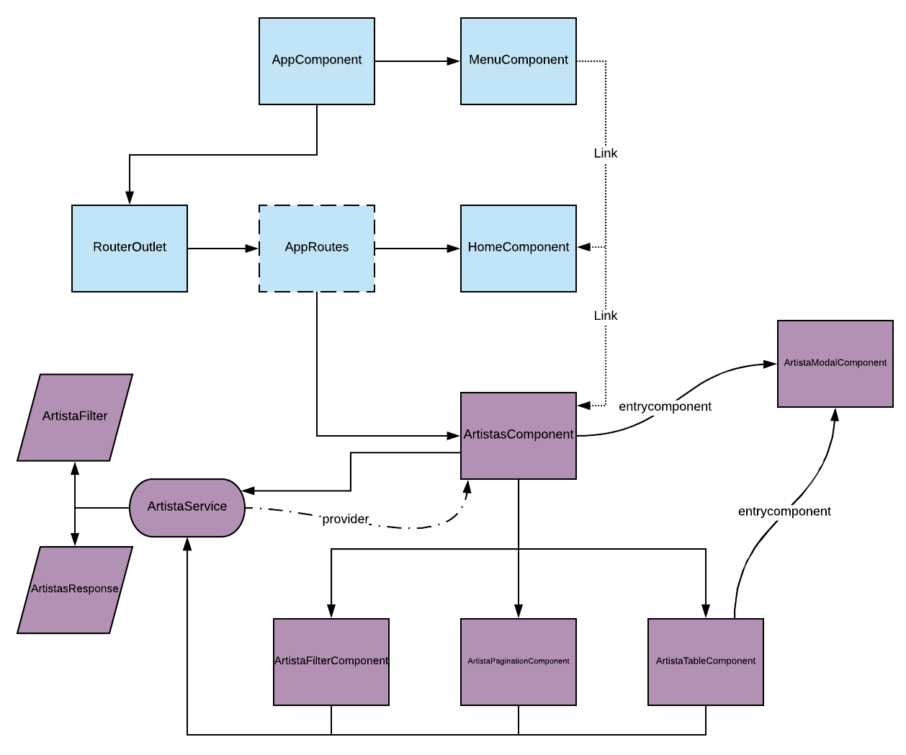

🌍 ∙ [English](angular.md) ∙ [Español](angular-es.md)

# Goten-generated Angular project

The following architecture is based on a model of 'artistas',but what gets generated for any CRUD model is the same.The base project components (what gets created when we execute 'goten new <projectName>') are the blue ones, while model-related are purple.

## Architecture scheme 

## Base structure

By executing 'goten new-angular <projectName>', goten will start generating the base structure for the Angular project (same as 'ng new project', but also installing the dependencies *Bootstrap 4* and fontawesome*). In addition, the following structure is generated:

- `project/src/app/components/`: folder where all generated components are added.
- `project/src/app/components/home.component/*`: component **home**, initial screen of the app.
- `project/src/app/components/menu.component/*`:component **menu**, where tabs and their respective links to components are registered. In **menu.component.ts** you can see two commented lines (*// \<tabs>* and *// \</tabs>*). These are tags used by goten to add code dynamically (i.e., when executing 'goten abm <modelName>'), which is why these shouldn't be modified.
- `project/src/app/components/generics/*`:generic components that are going to get used by others as a template.
- `project/src/app/dtos/`: folder where entity-related files are added.
- `project/src/app/dtos/filters/`: folder where the filters used in the forms will be added. From these you will get the * queryString * to query the API.
- `project/src/app/dtos/filters/generic.filter.ts`:generic filter, to be used by others as a template. Has a method toQueryString' that obtains the queryString to use when making a request.
- `project/src/app/dtos/responses/generic.response.ts`: contains generic responses to be used by the services or as a template by other responses.

    - ***GenericResponse*** receives as a first parameter a mandatory type, which is used to set the structure of the data field from the response. The second type is optional, and is used to set the structure of the error that the API could return. It can be used by inheriting from this class, specifying the types as needed. The usage can be seen when requesting an entity by id to an API.

    - ***GenericListResponse*** follows the same principle as ***GenericResponse***, receives a mandatory type, is used to perform queries that return a list with a certain structure, which is defined by the specified type.

    - ***IdResponse*** is intended to be used when performing a **DELETE** against an *API*, which returns the *id* of the deleted object.

- `project/src/app/services/`:folder where generated services are added.
- `project/src/app/app.routes.ts`:this file defines the routes and the components where they each reference. There are four lines of comments ( *//\<imports>* , *//\</imports>* , *//\<routes>* and *//\</routes>*) that serve to register the new routes each time *goten* generates an **ABM**, that is why they should not be modified or deleted by the developer.
The essential components, and how they are related,are represented in the [graphic] (# angular-architecture) in light blue.

## ABM Structure 

When executing `goten abm-angular example`, goten generates the components, service, filter, responses and registers the routes in *app.routes.ts* (creating the tab in *menu.component.ts*). The generated files are:

- `project/src/app/dtos/example.dto.ts`:in this file, the class **ExampleDTO** will be created with the properties specified by the user (including any defined *Custom*).
- `project/src/app/dtos/filters/example.filter.ts`:this file exports the class *ExampleFilter*, which has all the native type properties (excluding arrays). This class is used to indicate the search criteria that you want to apply; it inherits from *GenericFilter* the *toQueryString* method that is used in queries.
- `project / src / app / dtos / responses / example.response.ts`: export the two possible responses.

    - ***ExamplesResponse***, which contains (in *data.list*) sa list of *ExampleDTO*.

    - ***ExampleResponse***, in which *data* is an *ExampleDTO*.

- `project / src / app / services / ejemplo.service.ts`: this file has two responsibilities.
On the one hand, it serves as a classic Angular service. It's an *Injectable* and its responsibility is to communicate with an external resource,in this case, the *API* specified when creating the project.
It also works as a **store**, based on the flux pattern. An instance of this class provides methods for communicating with the specified API, and two properties. One of them is *EjemploFilter*, which is modified from the components and is used to make a query. The other one is an *Observable*. When calling the method *getEjemplos*, this property is returned and the *ejemplos$* property is updated.
This way, due to every component related to *Ejemplo* are using the same instance of the service, they all can update the service's state, and anything that's been bound to these states will be updated automatically.
- `project/src/app/components/example/examples/`:component where *ExampleService* is registered as a provider.
It is the parent of *ExampleFilterComponent*,  *ExampleTableComponent* and *ExamplePaginationComponent*, it also has a button that, when clicked, opens the modal *ExampleModalComponent*, which is an *entrycomponent*. Both when creating this component and when successfully creating a new *example*, this component calls the method *getExamples* which updates its internal property *examples$*. This is unpacked with the *pipe* ***async***, and its content is passed to *ExampleTableComponent* and *ExamplePaginationComponent*.
- `project/src/app/components/example/example-table/`: receives a list of *ExampleDTO* to be able to show. It also allows you to open the modal to view, edit and delete each of the *examples*. The html generated for this component has a table, with one column for each property of the native type.
- `project/src/app/components/example/example-filter/`:this component has an input for each property of *ExampleFilter*. When a search is carried out, the method *getExamples* of *ExampleService* is executed, which updates the service status, and this automatically updates the content of *ExampleTableComponent*.
- `project/src/app/components/example/example-pagination/`: delegates the responsibility of pagination to *goten-pagination*, specifying that when changing pages, it is necessary to update the status of the service with the corresponding offset.
- `project/src/app/components/example/example-modal/`: this component is used to create, edit and view an *exampleDTO*. The inputs and labels are autogenerated for each property of *ExampleDTO*.