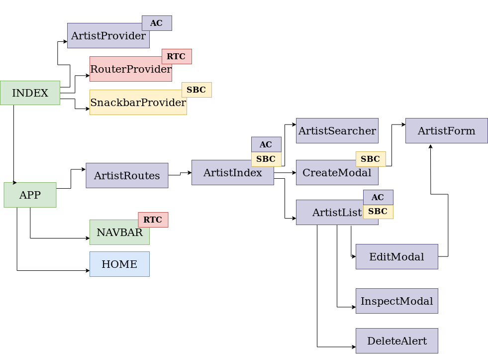
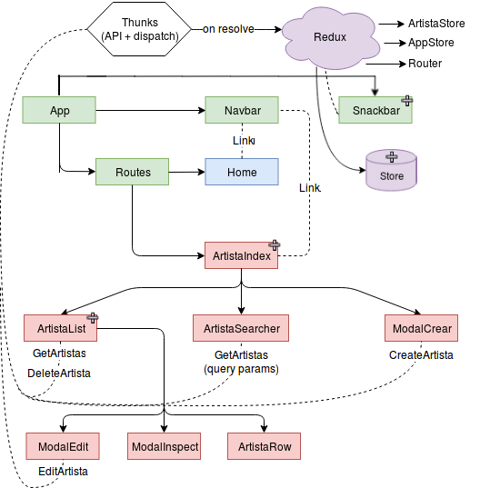

🌍 ∙ [English](react.md) ∙ [Español](react-es.md)

# Architecture Application React

The React application architecture varies according to the state manager you choose (by default it's Context, but you can choose Redux as an alternative)

## Index

1. [Architecture - Context ](#architecture-with-context)

  - 1.1 [Structure](#project-structure-context)

  - 1.2 [Configuration](#configuration-context)

  - 1.3 [Components](#components-context)

  - 1.4 [API Connection - Context](#connection-api-context)

2. [Architecture - Redux ](#architecture-with-redux)

  - 2.1 [Structure](#project-structure-redux)

  - 2.2 [Configuration](#configuration-redux)

  - 2.3 [Components](#components-redux)

  - 2.4 [API Connection - Redux](#api-connection-redux)

## Architecture with Context



The architecture of the React project with [Context] (https://reactjs.org/docs/context.html) uses different 'providers' to provide the state to the application. This is done globally (providers are the first components that are rendered), but each component can subscribe (or not) to different contexts.

Those that are created with the base application are **SnackbarProvider** (to show notifications type snackbar) and **RouterProvider** (used to navigate with react-router).

When creating an ABM with goten, a provider for this is also created (eg from the graphic: ArtistProvider), which contains the methods for making requests to the API and manages the corresponding state.

### Project structure - Context

It is divided into the folders **config** (how it connects to the back), **layout** (reusable components), **modules** (the components that represent the backend data) and **utils** ( useful functions and constants, including the functions used to connect to the API).

When an ABM is created, a folder with the name of the ABM is added in **modules**, and several files within it, including the one corresponding to the Context.

### Configuration - Context

The application is created using **create-react-app** (you can see the version of CRA Goten uses in the package.json, it is the same as react-scripts).

In the image you can see what the CLI would generate. There are components of different colors, and functions that will be used throughout the project.
- **Green**, these are the components that the user does not need to modify. The App component and the Navbar are quite static, since the CLI is responsible for generating the routes when creating modules, and adding the corresponding providers to `index.js`.
- **Blue**, this is the Home component. This *has* to be modified by whoever uses the CLI, since it has no configuration whatsoever and is made purely as a filler (which is supposed to be necessary for any project).
- **Red** represents the Router Context provider (RTC).
- **Yellow** represents the Snackbar Context provider (SBC).
- **Purple**, represents an ABM created with Goten. In this case, it's an ABM of Artists, and it has certain components that represent the model defined in the database. This example has the following form:

 ```js
artista = {
    name: String,
}
```
Also, Goten will generate the backend configuration and define the functions necessary to make calls to the API (assuming that the backend was generated with Goten as well).

Observation: Components that have acronyms located on the upper right indicate that they are subscibed to said Context (such as RTC for **RouterContext**), so they can use their methods and interact with their state.

### Components - Context

The components are explained below:

- **App**, is the main component of the application.
  - Define a **Navbar** in the header, which will have buttons with links to **Home** and the *modules* (if any). The navbar is exported with **withRouter** to perform navigation.
  - It also defines the routes ('/' -> Home, '/artists' -> ArtistRoutes, etc).
  - **RouterContext**, provides all the components related to the routing Context.
  - **RouterProvider**, will provide the context of the router to the entire application. It is used in the *index.js* of the application.
  - **withRouting**, a HOC to export components that you want to subscribe to everything exposed **RouterProvider** (state, methods, etc.). Mainly, to the method *redirectTo*.
  - **Routed**, the consumer component to use if you do not want to subscribe to everything that is exported from **RouterProvider**.
- **Snackbar** - **SnackbarContext**, component that uses the snackbar of material UI to show certain messages (it is used with Context so that it is easy to invoke it, it is also avoided to repeat code).
  - **SnackbarProvider**, will provide the context of the router to the entire application. It is used in the *index.js* of the application.
  - **withNotifier**, a HOC to export components that you want to subscribe to everything that exposes **SnackbarProvider** (state, methods, etc.). Mainly, to the methods *showSnackbar* and *closeSnackbar*.
  - **Notifier**, the consumer component to use if you do not want to subscribe to everything that is exported from **SnackbarProvider**.
- **ArtistaContext**, is the file that contains everything referred to Context for the Artist module. It's divided in:
  - **ArtistaProvider**, will provide the artist context to the entire application. It is used in the *index.js* of the application.
  - **withArtist**, a HOC to export components that you want to subscribe to everything that exposes **ArtistaProvider** (state, methods, etc.)
  - **ArtistConsumer**, the consumer component to use if you do not want to subscribe to everything that is exported from **ArtistaProvider**.
- **ArtistRoutes**, is a component that defines all the routes that begin with '/artists'. We decided this to avoid adding routes specific to a module into the App component. This way, we only import '<Module>Routes' in App, instead of any other routes we may want to define (that are specific to this module).
- **ArtistaIndex**, the main component of the Artists module.
  - Define a button to add artists (this interacts with Context). This opens a modal (**CreateArtistaModal**) that contains an **ArtistForm**.
  - Make use of *GotenPaginator* (with an **ArtistSearcher** and an **ArtistList**) to display the search results (with or without query params).
 - **ArtistSearcher** defines inputs according to the attributes that Artist has (assigning the correct types). When you click search, this calls the API using **ArtistaContext**, and when you receive a successful response, the data that comes will be saved in its state (in the attribute *artistaStore*). What is saved is the list of all artists (in the *list* attribute), and each paging parameter (*limit*, *offset* and *total*).
 - **ArtistList** has a *GotenList* that is hydrated by artists in *artistaStore* (in Context). The following components are rendered by *GotenList*:
   - **ArtistRow**, contain the Artist's information.
   - **EditArtistaModal**, has an **ArtistForm** to edit the fields of the selected artist. The data of it is passed by parameter when opening the modal.
   - **InspectArtistaModal**, has an **ArtistaForm** (in visualization mode) to see the fields of the selected artist. The artist's data is passed as a parameter when opening the modal.

For the components that make calls to the API using Context, promises are used for the different possible results (in case of error, the snackbar with the corresponding message is shown).

### Connection API - Context

The connection to the API is simple, the functions to be used in the folder `utils / api / api <Module_name> .js` were defined, and from Context what was done is a bit of logic for the store management, but always using these functions.

## Architecture with Redux



The architecture of the project in [Redux](https://es.redux.js.org) that would generate Goten is simple, modular and has incorporated certain common practices and libraries such as Bootstrap, Redux, Router. It also uses Goten packages to show its easy implementation and advantages it provides over others.

## Project structure - Redux

The structure is similar to the one created with [Context](#project-structure-context).It is divided into the folders **config** (how it connects to the back), **layout** (reusable components), **modules** (the components that represent the backend data), **utils** ( useful functions and constants, including the functions we use to connect to the API) and **redux** (definition of the reducers and the store).

Then, for the use of Redux we define a friendly structure, which is called [**'duck'**] (https://medium.freecodecamp.org/scaling-your-redux-app-with-ducks-6115955638be). This allows us to scale the application incrementally, so as not to have problems with large files that contain all the Redux logic. This structure is well explained in the linked article, but roughly, we will have a duck folder *for each* module, which will be independent of each other and represent certain functionality, and in these we will have the typical of Redux (constants of types, actions and action creators, and a new concept called operations).

## Configuration - Redux

In the image you can see what the CLI would generate. There are components of different colors, and functions that will be used throughout the project.

- **Green**, we have the components that will not be modified (or not necessarily) by the user. You can do it, but it would not be necessary since the configuration of the snackbar and the App is quite static, and the CLI takes care of generating the routes when creating modules.
- **Blue** there is the Home component. This *has* to be modified by whoever uses the CLI, since it has no configuration whatsoever and is made purely as a filler (which we assume is necessary for every project)
- **Purple** is represented what Redux and its store would be. Some components will be listening to the Redux store (they are marked with a small violet cross on the top right) while others will be dispatching to place orders with the API, or in the case of the snackbar to display and change their message.
- **Red** a model is represented on which the example of what the CLI would generate was made. This module is from Artists, and it has certain components that represent the model defined in the database. This example looks like this:

```js
artist= {
    name: String,
  }
```
Also, GotenCLI will generate the backend configuration and define the functions necessary to make calls to the API (assuming that the backend was generated with GotenCLI as well).

## Components - Redux

The components are explained below:

- **App**, is the main component of the application.
 - It has the necessary configuration to persist the information of Redux between tabs.
 - It also defines a **Navbar** in the header, which will have buttons with links to **Home** and the *modules* (if any), and also defines the routes ('/' -> Home, ' /artists' -> ArtistRoutes, etc).
- Finally, you have a *Snackbar* of UI material to show the errors that come from the backend (an axios interceptor is used), and any other message you want to show.
- **ArtistRoutes**, is a component that defines all the routes that begin with '/artists'. We decided this to avoid adding routes specific to a module into the App component. This way, we only import '<Module>Routes' in App, instead of any other routes we may want to define (that are specific to this module).
- **ArtistaIndex**, the main component of the Artists module.
 - Define a button to add artists (this interacts with Redux through a thunk function, which allows several dispatches to be followed), which opens a modal (**CreateArtistaModal**) that contains an **ArtistaForm**.
 - Make use of *GotenPaginator* (with an **ArtistSearcher** and an **ArtistList**) to display the search results (with or without query params).
 - **ArtistSearcher** defines inputs according to the attributes that Artist has (assigning the correct types). When you press search, this executes a dispatch that will execute the call to the API, and when you receive a successful response, the data that comes will be saved in Redux (in the corresponding store part, in this case, artistStore).
- **ArtistList** has a *GotenList* that is hydrated by artists in *artistaStore* (in Context). The following components are rendered by *GotenList*:
  - **ArtistRow**, are rendered by **ArtistList**, and contain the Artist's information.
  - **EditArtistaModal**, has an **ArtistForm** to edit the fields of the selected artist. The artist's data is passed as a parameter when opening the modal.
  - **InspectArtistaModal**, has an **ArtistaForm** (in visualization mode) to see the fields of the selected artist. The artist's data is passed as a parameter when opening the modal.

## API Connection - Redux

When we want to do a GET, POST, etc. to the API, this is handled with **thunk** functions. These are functions that return functions, simply. Then, we have our Redux store configured with middlewares so that we can dispatch these thunks. What are they for? So that in the same call to the API we can make several dispatches according to the answer. It is more convenient than defining them in the component, the code is less coupled, and it is easier to modify. An example would be:

```
const getArtistas = (queryParams = initialQueryParams) => (dispatch) => {
  dispatch (toggleLoadingArtists ())
  axios.get (urlApiArtistas, {... queryParams})
  .then ((response) => {
    dispatch (updateArtists (response.data))
    dispatch (toggleLoadingArtists ())
  })
  .catch ((err) => {
    dispatch (errorUpdateArtists (response.data))
    dispatch (toggleLoadingArtists ())
  })
}
```

And then, when we want to obtain artists, in some method of a React component that is connected with Redux we simply do:

`dispatch(getArtistas())`